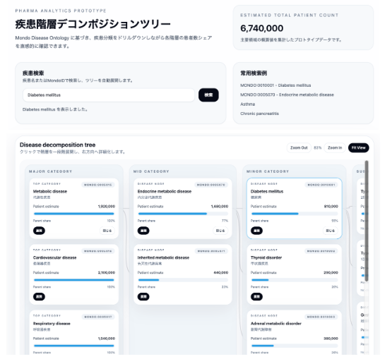

# 疾患階層デコンポジションツリー

## プロジェクト概要

**Mondo Disease Ontology（世界標準疾患オントロジー）** に基づき、疾患の大分類から細分類までをドリルダウンしながら、各階層の患者数（推定値）を直感的に可視化・監視できる Web アプリケーションプロトタイプです。

製薬企業のマーケターやスペシャリストが、疾患領域ごとの患者規模を階層的に把握し、医薬品の市場性評価に活用することを想定しています。



---

## 意義：患者数マネジメントと薬の市場性把握

### なぜ Mondo ID で患者数を管理するのか？

#### 1. **グローバルな疾患分類の標準化**
- Mondo Disease Ontology は、WHO の ICD-11、SNOMED CT など複数の国際疾患分類を統一
- 各疾患に一意の ID（例：`MONDO:0010001`）を付与
- 世界中の医療データとの相互運用性を確保

#### 2. **市場性評価の正確性向上**
- 単一の疾患名（例：「糖尿病」）では、サブタイプ（1型 / 2型 / 妊娠型）による患者規模の差異が見落とされやすい
- Mondo ID で細分類まで管理することで、**ターゲット疾患の正確な患者数把握** が可能に
- 例：2型糖尿病の患者数は1型の3倍以上 → 医療用医薬品の開発優先順位が変わる

#### 3. **医薬品開発の ROI 最適化**
- 患者数が少ない希少疾患（オーファンドラッグ）vs. 患者数が多い一般疾患
- 階層構造により、親疾患に対する当該疾患の「患者シェア」を瞬時に算出
- 開発リソースの配分判断を迅速化

#### 4. **規制要件・市場戦略への対応**
- FDA / EMA の医薬品承認では、ターゲットポピュレーション定義が重要
- Mondo ID で疾患定義を統一 → 臨床試験の患者層定義の透明性向上
- グローバル展開時の疾患層別化マーケティングに活用

---

## システムの特徴

### インタラクティブなツリーUI

- **左（上位階層）から右（下位階層）への展開**：クリックで段階的にドリルダウン
- **親子関係の可視化**：SVG 線で親ノードと子ノードを結接
- **患者シェア表示**：各ノード内の青いプログレスバーで親疾患に対する患者割合を可視化
- **展開・閉じる制御**：任意の階層で展開・閉鎖でき、ツリーをコンパクトに管理

### 高度な検索・ナビゲーション

- 疾患名（日本語・英語両対応）または Mondo ID で検索
- 検索結果のノードまで自動展開し、ハイライト表示
- Zoom In / Out / Fit View で全体俯瞰と詳細確認を切り替え

### プロフェッショナルなデザイン

- Tailwind CSS + Framer Motion による、洗練されたダッシュボード UI
- 医療・製薬企業向けの清潔感と信頼感
- レスポンシブデザイン対応

---

## セットアップ手順

### 前提条件

- **Docker** および **docker-compose** がインストール済みであること
- **Git** がインストール済みであること
- ターミナル / コマンドプロンプトが使用可能であること

### ステップ 1：リポジトリをクローン

```bash
git clone https://github.com/kmbsweb/patiants_count_diagram
cd patiants_count_diagram
```

### ステップ 2：Docker ビルド

```bash
docker compose up --build -d
```

このコマンドで以下が実行されます：

1. Node.js Alpine イメージをベースに Next.js アプリケーションをビルド
2. プロダクション出力（standalone mode）を最適化
3. ポート `3000` でコンテナを起動

### ステップ 3：ブラウザで確認

ブラウザで以下 URL にアクセス：

```
http://localhost:3000
```

---

## 使用方法

### 基本操作

#### 疾患の検索・展開

1. **検索バーに入力**：疾患名（例：「糖尿病」「Diabetes」）または Mondo ID（例：「MONDO:0010001」）を入力
2. **「検索」ボタンをクリック**：自動的にツリーが該当ノードまで展開
3. **該当ノードがハイライト**：青い枠で視覚的に強調

#### 階層ドリルダウン

- 各ノードの **「展開」ボタン**：クリックして 1 段階下へドリルダウン
- **「閉じる」ボタン**：該当階層を折り畳み
- 各ノードの情報：
  - 患者数（推定値）
  - 親疾患に対する患者シェア（%）
  - Mondo ID

#### ズーム操作

- **「Zoom In」**：ツリーの詳細を拡大表示（最大 200%）
- **「Zoom Out」**：ツリー全体を縮小表示（最小 50%）
- **「Fit View」**：自動的にビューを最適化

### サンプル検索

以下の検索例が利用可能です：

| 検索キーワード | 説明 |
|---|---|
| `糖尿病` | 日本語名で検索 |
| `Diabetes mellitus` | 英語名で検索 |
| `MONDO:0010001` | Mondo ID で検索 |
| `2型糖尿病` | 細分類で検索 |
| `喘息` | その他の疾患 |

---

## Docker コンテナの管理

### コンテナを停止する

```bash
docker compose down
```

### コンテナのステータスを確認

```bash
docker compose ps
```

### ログを確認

```bash
docker compose logs -f patiants_count_diagram-web
```

### コンテナを再起動

```bash
docker compose restart
```

---

## 技術スタック

| 技術 | 用途 |
|---|---|
| **Next.js 14** | React フレームワーク + SSR 対応 |
| **React 18** | UI コンポーネント開発 |
| **TypeScript** | 型安全性の確保 |
| **Tailwind CSS** | ユーティリティファースト CSS |
| **Framer Motion** | アニメーション効果 |
| **Docker** | コンテナ化 / マルチステージビルド |

---

## プロジェクト構成

```
patiants_count_diagram/
├── app/
│   ├── layout.tsx          # ルートレイアウト
│   ├── page.tsx            # メインページ（検索 + ツリー表示）
│   └── globals.css         # グローバルスタイル
├── components/
│   ├── MondoTree.tsx       # ツリー描画コンポーネント
│   └── ui/
│       ├── button.tsx      # ボタンコンポーネント
│       └── input.tsx       # 入力フィールドコンポーネント
├── data/
│   └── mondoData.json      # Mondo 疾患階層データ（サンプル）
├── public/                 # 静的ファイル
├── docs/                   # ドキュメント・画像
├── Dockerfile              # Docker マルチステージビルド
├── docker-compose.yml      # Docker Compose 設定
├── next.config.js          # Next.js 設定
├── tailwind.config.ts      # Tailwind CSS 設定
├── package.json            # 依存パッケージ
└── tsconfig.json           # TypeScript 設定
```

---

## Mondo Disease Ontology とは

Mondo Disease Ontology は、**生物医学オントロジー（Biomedical Ontology）の標準規格** です。

- **官営機関**：NIH、WHO など
- **統合対象**：ICD-10、ICD-11、SNOMED CT、Orphanet、MeSH など
- **更新頻度**：定期的にメンテナンス
- **公開 URL**：[https://mondo.monarchinitiative.org/](https://mondo.monarchinitiative.org/)

### 疾患 ID の例

```
MONDO:0010001     Diabetes mellitus（糖尿病）
MONDO:0010002     Thyroid disorder（甲状腺疾患）
MONDO:0005017     Respiratory disease（呼吸器疾患）
```

---

## カスタマイズ方法

### データの更新

疾患データは `data/mondoData.json` に保存されます。新しい統計データを反映する場合：

1. `data/mondoData.json` を編集
2. 以下の構造を保つ：

```json
{
  "id": "MONDO:XXXXXXX",
  "name": "Disease Name (English)",
  "nameJa": "疾患名（日本語）",
  "count": 患者数,
  "children": [...]
}
```

3. Docker を再ビルド：

```bash
docker compose down
docker compose up --build -d
```

### UI カラーの変更

`tailwind.config.ts` で色スキームをカスタマイズ可能：

```typescript
theme: {
  extend: {
    colors: {
      brand: {
        500: '#2563eb',  // プライマリーカラー
      },
    },
  },
}
```

---

## トラブルシューティング

### Docker ビルドに失敗する場合

```bash
# キャッシュをクリアして再ビルド
docker compose down
docker system prune -a
docker compose up --build -d
```

### ポート 3000 が既に使用されている場合

`docker-compose.yml` でポートを変更：

```yaml
ports:
  - "3001:3000"  # 外部ポートを 3001 に変更
```

### 検索が反応しない場合

1. ブラウザのコンソールでエラーを確認
2. Docker ログを確認：`docker compose logs -f`
3. コンテナを再起動：`docker compose restart`

---

## ライセンス

このプロジェクトは MIT ライセンスの下で配布されています。

---

## サポート・フィードバック

機能追加・改善提案は、GitHub Issues または Pull Request でお知らせください。

---

## 参考資料

- [Mondo Disease Ontology](https://mondo.monarchinitiative.org/)
- [Next.js Documentation](https://nextjs.org/docs)
- [Tailwind CSS](https://tailwindcss.com/)
- [Framer Motion](https://www.framer.com/motion/)

---

*最終更新：2026年5月5日*
